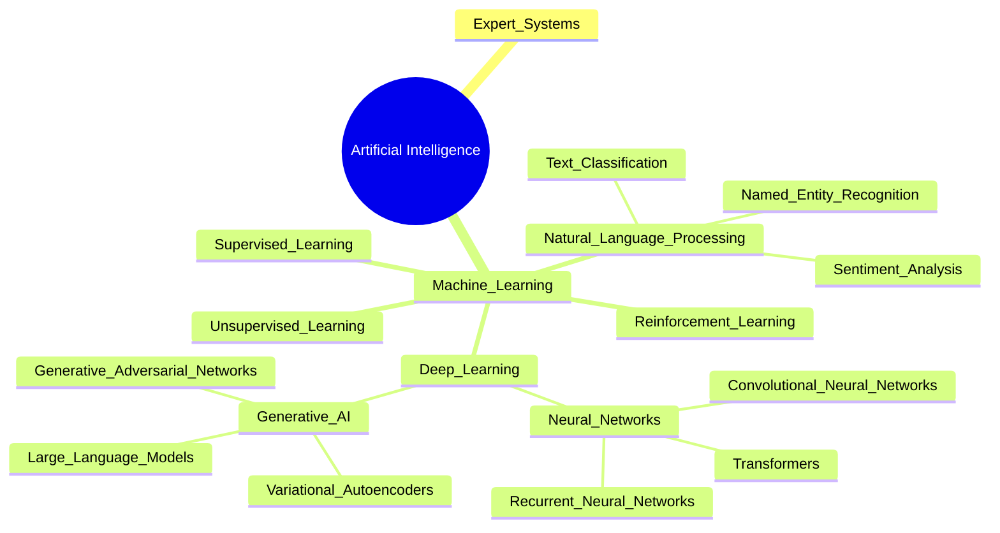
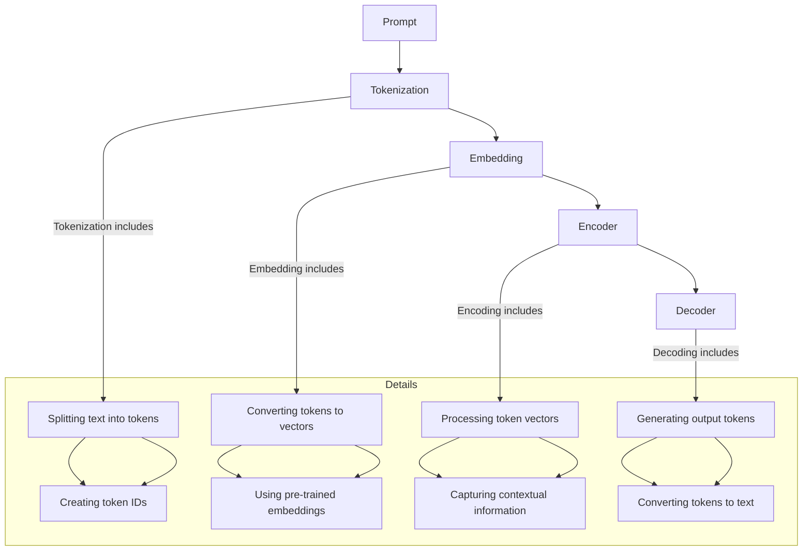
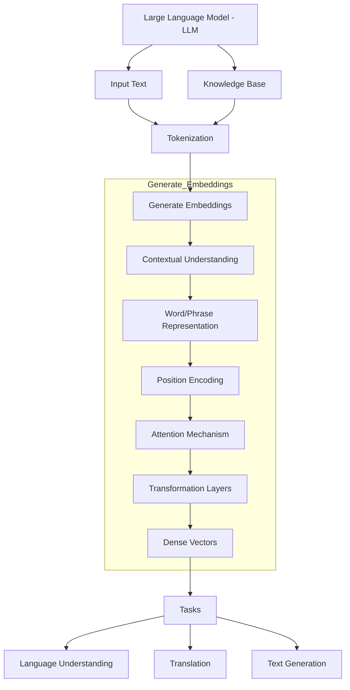
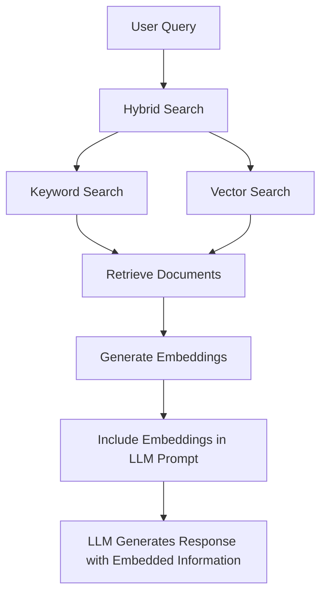
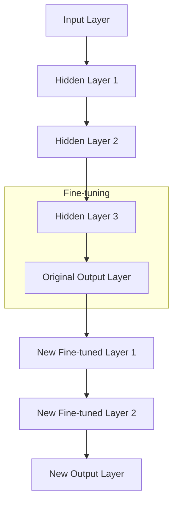
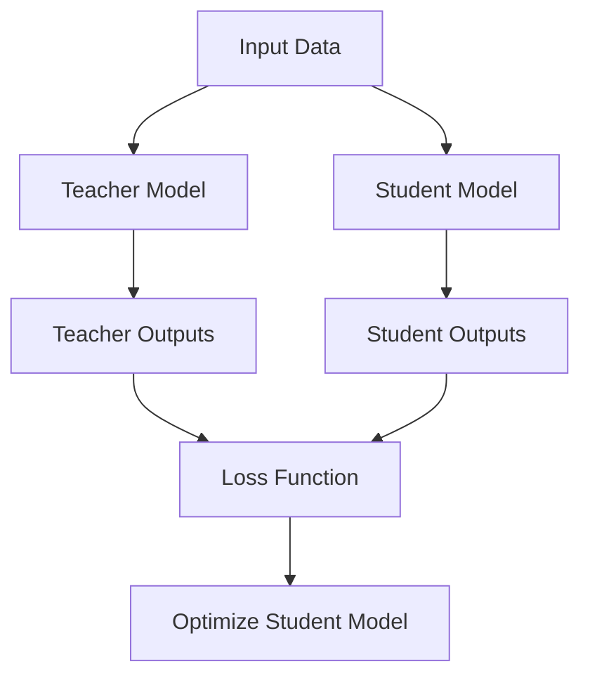
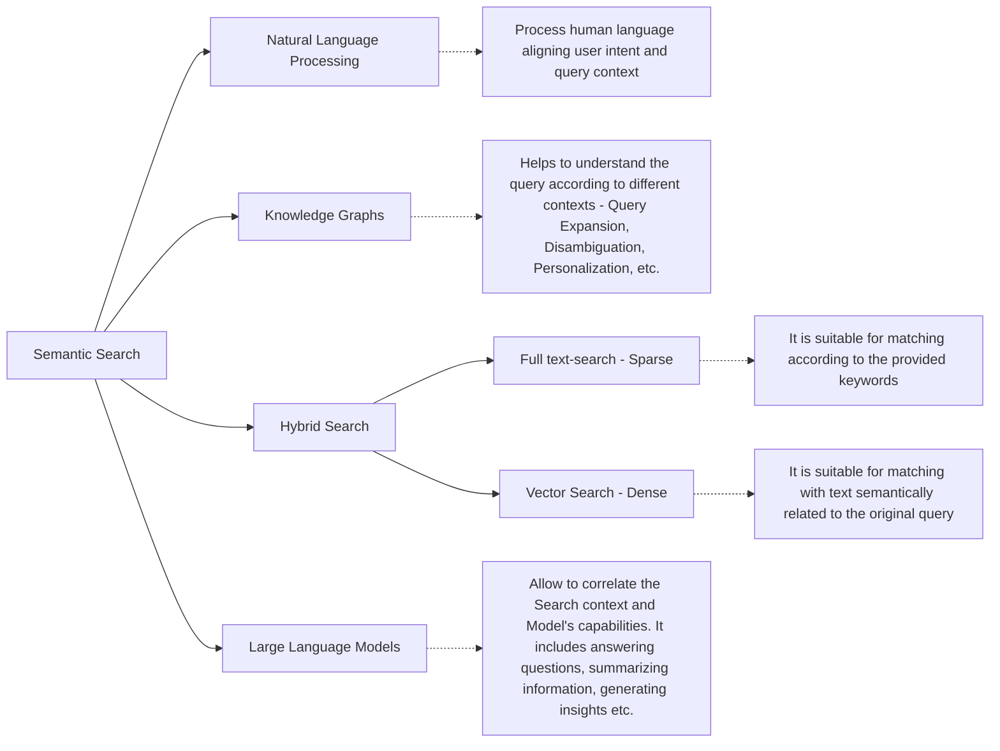
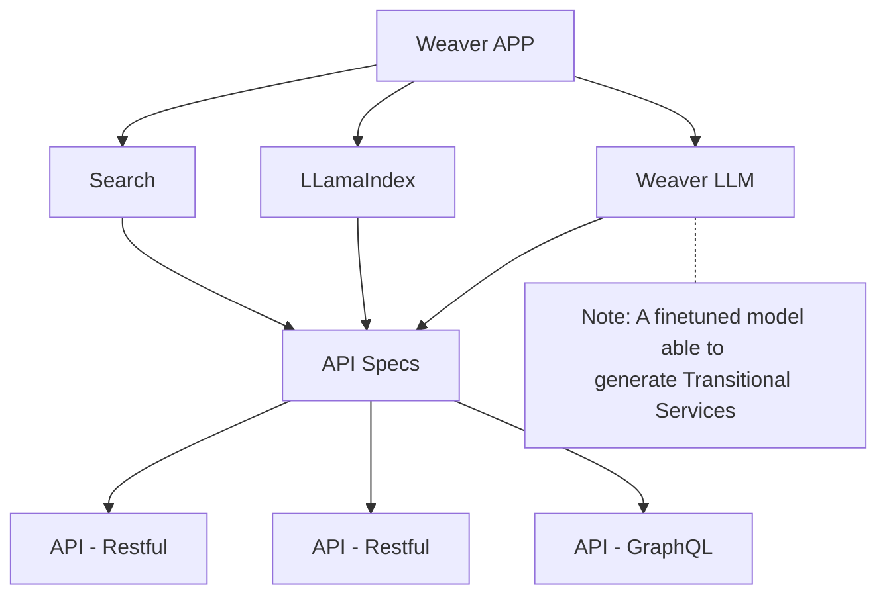
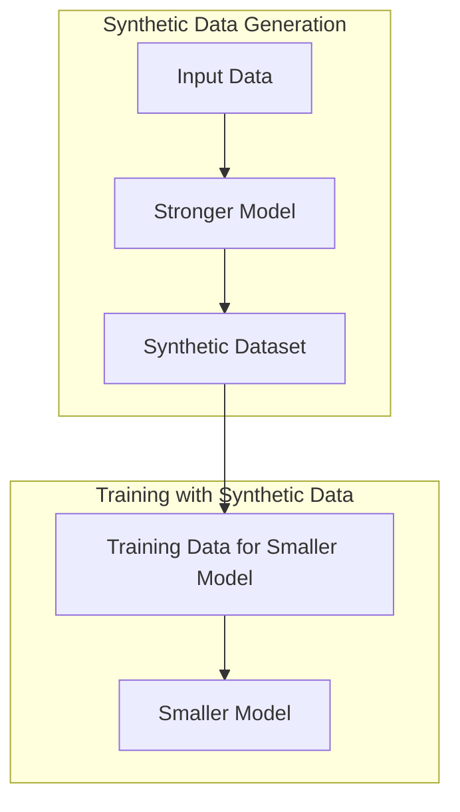
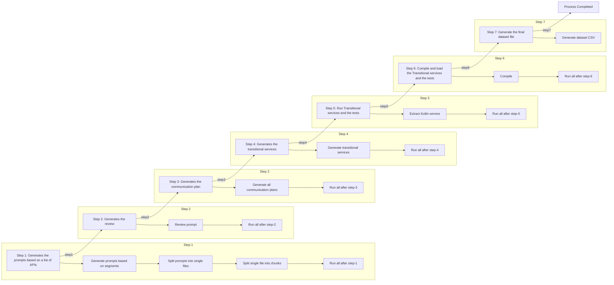

# Agenda

- AI Field - overview
  - Expert Systems
	- Machine Learning
		- Deep Learning
			- Neural Networks
				- Large Language Models
				- Transformers
				- Large Language Models
					- GPT 1, 2, 3
					- LLama, LLama 2, Code LLama, LLama3
					- Bert (Bidirectional Encoder Representations from Transformers)
				- Curiosities:
					- **Masked Language Modeling (MLM)**: Masked language modeling involves training a model to predict a missing word in a sentence. During training, certain words in the input sentence are randomly masked, and the model is tasked with predicting these masked words based on the surrounding context.
					- **Autoregressive Language Modeling (Used by OpenAI's GPT Models):** In autoregressive language modeling, the model is trained to predict the next word in a sequence based on the previous words. This approach generates text in a left-to-right manner.
					- The training Data: https://x.com/mark_cummins/status/1788949893903511705
		- Models
      - Large Language Models
      - Small Language Models
- Tools and References
  	- HuggingFace
    - LM Studio
    - Olama
    - CodeLab
    - Perplexity.AI
- LLMs Key Concepts
  - Prompts
  - Tokens
  - Embeddings
- LLMs Interaction
  - Prompt Engineering
  - RAG (Retrieval Augmented Generation)
  - Finetuning

- Semantic Search
	- Keyword Search
	- Vector Search
		- Embedding Models
	- Hybrid Search
	- Knowledge Graphs
		- Neo4J Cypher
	- Natural Language Processing
		- BERT
- Proof of Concept
	- RAG
	- Generating Transitional Services


## Disclaimer

- I started to effectively study about LLMs in November 2023.
- I don't have a background working with Data Science.
- The following topics are a compilation of my learnings and can be inaccurate. =)
- Some snippets were extracted from the book [Generative AI in Action](https://www.manning.com/books/generative-ai-in-action), others from ChatGPT.

## Motivation

AI is a real trend and is quickly transforming the IT area. Be passive about these innovations is a risk for our careers and business.


# Introduction

The ChatGPT was launched on November 30, 2022. According to Wikipedia it's credited to start the new AI Boom. 

The GPT (Generative Pre-trained Transformer) models from OpenAI are based on the innovations described in the paper [Attention is All You Need - 2017](https://arxiv.org/abs/1706.03762). This paper, authored by researchers from Google, described a new architecture for neural networks called the Transformer, which has been instrumental in improving machine translation and other natural language processing tasks.

## The AI field



## The LLMs

### Foundational Models

### Generative AI

Generative AI and foundational models are closely interlinked. As we outlined, foundational models, trained on massive data sets, can be adapted to perform various tasks; this property makes them particularly suitable for generative AI and allows for creating new content. 

https://livebook.manning.com/book/generative-ai-in-action/chapter-2/v-7/point-18772-16-16-0

Examples of foundational models:

- **GPT (OpenAI)**: GPT (Generative Pre-trained Transformer) is a natural language processing model developed by OpenAI. It is a large language model, which means it has been trained on a massive dataset of text and code.
- **Bert (Google)**: BERT (Bidirectional Encoder Representations from Transformers) is a natural language processing model developed by Google. It is a bidirectional model, meaning it can process text in both directions, from left to right and right to left. This makes it better at understanding the context of words and phrases.
- **LLama (Meta)**: Llama is a family of autoregressive large language models developed by Meta AI. 
  - LLama 1: February 2023
  - LLama 2: July, 2023 (Commercial License)
  - LLama 3: July, 2024


### The Transformers Architecture

> Transformers are the bedrock of foundational models responsible for their remarkable language understanding capabilities. The Transformer model was first introduced in the paper "Attention is All You Need" by Vaswani et al. in 2017. Since then, Transformer-based models have become state-of-the-art for many tasks. GPT and BERT are examples of Transformer-based models; the "T" in GPT stands for Transformers.

> At their core, Transformers use a mechanism known as attention (specifically self-attention), which allows the model to consider the entire context of a sentence, considering all words simultaneously rather than processing the sentence word by word. This approach is more efficient and can improve results on many NLP tasks.

https://livebook.manning.com/book/generative-ai-in-action/chapter-2/v-7/point-18773-30-43-0


> The key point is that while these models can generate text based on the data they were trained on, they do not learn or update their knowledge after the training cut-off. They cannot access or retrieve real-time information from the internet or any external database. Their responses are generated purely based on patterns they have learned during their training period.


### Types of LLMs

- Base LLM: Are the original pre-trained models. 
  - Is flexible but not so accurate.
- Instruction based LLM: A fine-tuned model able to process 
instructions.
  - Can be precise but requires more attention in the prompt.
- Fine-tuned LLM: Involves the enhancement of the LLM for more specialized tasks based on a specific domain.
  - Can be precise, but bring the risk of overfitting the training data. And can limit the ability to generalize to new examples.

__Ways of adapting an LLM for a specific task__:

- Zero-shot Learning: Example, the LLM can know how to Translate a word from English to another language without being specifically trained for it. The LLM can do it by using semantic similarity, word embedding and machine leaning. 
- Few-shot Learning: Involves showing the model examples of the task we'd like to perform. 
- Transfer Learning: Involves training a model for solving a specific task and than using the LLM for solving a similar task.

### LLMs - Key Concepts



#### Prompts and Prompt Engineering

The prompt is how we interact with LLMs. It is a text description of the task we want the LLM to perform. More advanced tasks require a more elaborate prompt.

This need has led to the development of Prompt Engineering, which involves techniques for extracting the most accurate answers from an optimized prompt.

Example of Open AI's default prompt:

```
...
Use all possible different descents with equal probability. Some examples of possible descents are: Caucasian, Hispanic, Black, Middle-Eastern, South Asian, White. They should all have equal probability.
 
Do not use 'various' or 'diverse'. Don't alter memes, fictional character origins, or unseen people. Maintain the original prompt's intent and prioritize quality. Do not create any imagery that would be offensive.
 
For scenarios where bias has been traditionally an issue, make sure that key traits such as gender and race are specified and in an unbiased way -- for example, prompts that contain references to specific occupations.
...
```

#### Tokens

- Are the basic units of text used by a Large Language Model to process the request and the response.
- Differents LLMs uses different tokenization strategies. They aren't exchangeable/interchangeable.
- The number of tokens influence the cost regarding money and experience with latency and throughput.


__See__: 
- https://platform.openai.com/tokenizer
- https://platform.openai.com/playground/complete


#### Embeddings

Embeddings are dense vectors with multiple dimensions, where each dimension represents a feature extracted during model training. These features collectively encode semantic and syntactic information about the tokens.

**The same word can have different embeddings depending on its context. Different words in similar sentences will have a close relation.**

- __Contextual Embeddings__: In models like BERT or GPT, the embedding for a word can change based on its context within a sentence. For example, "apple" in "I ate an apple" (fruit context) will have a different embedding than "apple" in "Apple released a new iPhone" (company context).

- __Semantic Similarity__: Different words in similar sentences can have embeddings that are close to each other in the vector space, indicating a semantic relationship. For instance, in the sentences "The dog barked" and "The cat meowed," the embeddings for "dog" and "cat" might be close due to their similar roles as animals in similar contexts.

- __Training Influence__: The semantic relationships captured by the embeddings depend on how the model was initially trained. The quality and diversity of the training data significantly impact the embeddings' ability to represent different contexts and semantic similarities accurately. 




See:
- https://openai.com/index/introducing-text-and-code-embeddings/


### LLMs Interaction

There are different ways of interact with the LLMs, all of them can be combined.


#### Prompt

Interacting with the LLM by providing specific prompts or questions to generate responses.

Example of a Prompt for generate Transitional Services:

```
The Transitional Gateway DSL, is a DSL to ease the task of declaring Restful endpoints. The DSL have the following sections:

- Types Definition
- Service Definition
- Parameters Definition
- Destination Definition
- Request/Response Definition

Following is a representations of which commands are supported by the DSL when declaring a Transitional Service. The possible values are split by ||. for example: `get||post||put||delete` means you can use the http method `get`, `post`, `put` or `delete`.


import com.alphasights.transitional.gateway.transitional.service.dsl.transitional
import com.alphasights.transitional.gateway.api.ServiceContractType
import kotlin.test.*
import org.skyscreamer.jsonassert.JSONAssert
import org.skyscreamer.jsonassert.JSONCompareMode

transitional {
    types(namespace) {
		  type(type-name) { 
		    fields { 
		      string||boolean||integer(field-names) 
		      fieldOf(field-name, type-name)
		      arrays {
		        string||boolean||integer(parameterNames)
		        fieldOf(field-name, fully-qualified-type-name) //You have to specify the full class name. This method is equivalent to the 'x-class' property.
		        fieldOf(field-name, fully-qualified-type-name, ServiceContractType.NAMESPACE) //The NAMESPACE indicates the field type is declared using the same namespace.
		      }
		    }
		  }
		}
    settings {
        port("8080") //Port number where the services will run.
    }
    manifests {
		namespace(namespace) //It should match with the types namespace.
        service("service-name") {
            path("/service-path")
            get||post||put||delete { //You can use different http methods
                sequential||parallel() //Indicates when the destinations will run in parallel or sequentially
				parameters {
				  path||header||query { //Indicates the type of parameter
					optional||required { //Indicates if the parameters will be required or optional
					  string||boolean||integer(parameterNames) //Declares parameters like the defined types
					  arrays {
						string||boolean||integer(parameterNames) //Declares parameters like arrays of the defined types
					  }
					  name(name-of-a-single-parameter) //Defaults to String
					  name(name-of-a-single-parameter) { //Define a single parameter with more detailed info
						dataType(ServiceParameterValueType.STRING)
						urlEncoded()
						splitBy(",")
						example(example-of-value)
						default(default-value)
						description(parameter-description)
					  }
					}
				  }
				}
				destinations { //All destinations must be declared in the order it must be executed.
					static("static-destination-name") {
						// Common properties
						splitBy("delimiter for splitting responses, if applicable")
						
						// Specific to static destinations
						content("Static content to be returned")
					}
					
					bean("bean-destination-name") {
						// Common properties
						splitBy("delimiter")
						
						// Specific to bean destinations
						beanName("name of the bean defined in settings")
						methodCall("methodName to be invoked on the bean")
					}
					
					http("http-destination-name") {
						// Common properties
						splitBy("delimiter")
						
						// Specific to http destinations
						host("URL of the external service")
						path("path to the specific endpoint, if needed")
						headers { // Optional
							header("key", "value") // Static headers
							// Dynamically set headers can also be specified
						}
					}
					
					graphql("graphql-destination-name") {
						// Common properties
						splitBy("delimiter")
						
						// Specific to graphql destinations
						host("GraphQL service URL")
						templates {
							query(\"\"\"
								query MyQuery($$variables) {
									...
								}
							\"\"\")
							variables(\"\"\"
								{
									"variable1": "value1",
									"variable2": "value2"
								}
							\"\"\")
						}
					}
					
					drools("drools-destination-name") {
						// Common properties
						splitBy("delimiter")
						
						// Specific to drools destinations
						rules("Path or identifier for Drools rules")
						// Additional configurations for Drools can be specified if needed
					}
					
					process("processor-destination-name") {
						// Common properties
						splitBy("delimiter")
						
						// Specific to processor destinations
						processor("Name or identifier of the processing function")
					}
                }
            }
        }
    }
}

```

#### RAG

RAG stands for Retrieval Augmented Generation, a technique where documents are included in the context of your prompts.

As LLMs are essentially offline and function as next-token predictors, they can lack accuracy when specific information was not available during training (e.g., private or recent data).

To combine the model's language capabilities with real facts from documents, you can generate embeddings (dense vectors in high-dimensional space) and include them in your requests.

There are multiple RAG architectures, but the key is to provide relevant embeddings to the LLM when making a request.

Techniques such as Hybrid Search (Keyword Search + Vector Search) and Knowledge Graphs can be used to find the most relevant documents before submitting them to the LLM.

__Note__: In August 2020, Facebook AI (now Meta AI) introduced a formalized RAG model in their paper "Retrieval-Augmented Generation for Knowledge-Intensive NLP Tasks". This model combines a dense retrieval component (such as a retriever model) with a generative component (such as a BERT-based generator), enabling the generation of responses that are both contextually relevant and factually accurate by retrieving relevant documents or snippets to inform the generation process.



#### Finetune

Fine-tuning an LLM is used to train the model to adhere to specific formats, styles, or behaviors, rather than focusing on factual content.

Through fine-tuning, the model learns to respond in a manner that aligns with the desired output format, structure, or tone for a particular domain or task. By combining this fine-tuning with the 

Retrieval-Augmented Generation (RAG) approach, you can ensure that the model produces responses in the expected format while incorporating accurate and relevant factual data from external sources.

Following are some important concepts when finetuning a model:

__Transfer Learning__: Transfer learning is a technique in machine learning where a model developed for one task is reused as a starting point for a similar task. Instead of starting from scratch, we use the knowledge from the previous task to perform better on the new one. It's like using knowledge from a previous job to excel at a new but related job.



__Quantization__: Large Language Models (LLMs) internally use floating-point numbers to represent the weights of their neural networks. These floating-point numbers can have different bit sizes, such as 32-bit (float32) or 16-bit (float16), which affect the precision and accuracy of the models. When faced with resource constraints, such as limited memory or computational power, one can choose to load and process these models using lower precision numbers, like float16. This approach reduces the resource requirements for training and running the LLMs, while typically incurring only a minimal loss in precision and model performance. By optimizing the precision of the floating-point numbers, it is possible to achieve a balance between resource efficiency and model accuracy.

References:
- https://symbl.ai/developers/blog/a-guide-to-quantization-in-llms/
- https://www.tensorops.ai/post/what-are-quantized-llms


__Knowledge Distillation__: Knowledge Distillation is a powerful technique for creating smaller, efficient models by leveraging the knowledge of larger, pre-trained models. The smaller model is trained to replicate the behavior of the larger model, using a combination of hard and soft targets, thereby achieving a balance between performance and resource efficiency.



# Semantic Search




# The Proof of Concepts

## Text to Transitional Services



### The goal

The ultimate goal is to have a model able to create Transitional Services based on simple input such as:

> Generate a Transitional Service for the path `/project/{id}` responsible for calling the Graphql query `projects` from __Pistachio__, enrich the `project.anchor_companies` and `project.investment_targets` with the companies by calling CDS with the respective cds alphacompany Ids.

So, this solution will have to have the following capacity:

- Have access the latest stage of our APIs.
- Generate Transitional Services definitions based on the Transitional Gateway DSL (Including the Tests). 
- Validate if the generate service works.


### Challenges

- How to validate if a Transitional Service is properly working?
- To properly finetune the model, I have to have a good dataset with Transitional Services examples.
	- Currently we have more than 300 endpoints in the Transitional Services project. But they are all private data related to the Alphasights domain. For creating this proof of concept I aimed for using only public data.
	- This way, I opt for generating a synthetic dataset, with artificial code assisted by a more Powerful model such as GPT3/4.

### The Synthetic Dataset

I am using a technique related to knowledge distillation where a stronger model generates a synthetic dataset, which is then used to train a smaller model. This approach helps the smaller model learn from the stronger model's capabilities indirectly.



The dataset generation followed the following steps:

#### 1. API's segment list

Where I generated a list of API Segments such as: "Payment APIs - PayPal", "Social Media APIs - Facebook", "Communication APIs - Twilio".

#### 2. Prompt Generation 

Where the script will generate prompts of Transitional Services according to the segments.

__Example of prompt__:

__Prompt 3 - Combine Profile and Posts__

> Design a service that integrates with Facebook's API to combine a user's profile information and recent posts into a single response. Fetch the user's profile details and recent post content separately and then merge this data to generate a complete user profile along with post content.

#### 3. Simple Service Structure

The Simple Service Structure is an intermediary definition containing superficial service details such as the service name, description, inputs, outputs, endpoints, and methods, used to assist in generating the Transitional Service for the dataset at the end of the dataset creation process.

While developing the solution, I noticed it was more effective to generate an intermediary definition based on the prompt, so it can assist to generate the Transitional Service for the dataset at the end of the process. I ended up with the Simple Service Structure concept, it contains just the superficial definitions of the service. Example:

```
socialMediaIntegration {
	//Mock Service for Combined Profile and Posts
	GET /user/{userId}/complete-profile -> sequential(
		static:mock-combined-profile
	)
	
	//Main Service
	GET /user/{userId}/complete-profile -> sequential(
		http:retrieve-user-profile,
		http:retrieve-user-posts,
		process:combine-profile-and-posts
	)
}
```

Note: Sometimes the Simple Service Structure will be generated wrong. So I created a simple service structure review step, to identify errors. Surprisingly the GPT can identify error itself created.

#### 4. Communication Plan

The communication plan is based on the Prompt and the Simple Service Structure, it will contains more details about the integrations between the APIs. Example:

```yaml
namespace: socialMediaIntegration
services:
  - name: mockCombinedProfileService
    description: Mock service to provide combined user profile and post data for testing.
    path: /user/{userId}/complete-profile
    method: GET
    destinations:
      - type: static
        content: >
          {
            "userProfile": {
              "userId": "12345",
              "name": "John Doe",
              "email": "johndoe@example.com",
              "location": "City, Country",
              "bio": "This is a sample user profile."
            },
            "posts": [
              { "postId": "post1", "content": "This is the first post." },
              { "postId": "post2", "content": "This is the second post." }
            ]
          }

  - name: retrieveUserProfileService
    description: Fetches the user's profile information from Facebook API.
    path: /user/{userId}/profile
    method: GET
    parameters:
      - name: userId
        in: path
        required: true
        description: Unique identifier of the user
    destinations:
      - type: static
        content: >
          {
            "userId": "12345",
            "name": "John Doe",
            "email": "johndoe@example.com",
            "location": "City, Country",
            "bio": "This is a sample user profile."
          }

  - name: retrieveUserPostsService
    description: Fetches the user's recent posts from Facebook API.
    path: /user/{userId}/posts
    method: GET
    parameters:
      - name: userId
        in: path
        required: true
        description: Unique identifier of the user
    destinations:
      - type: static
        content: >
          {
            "posts": [
              { "postId": "post1", "content": "This is the first post." },
              { "postId": "post2", "content": "This is the second post." }
            ]
          }

  - name: combineUserProfileAndPostsService
    description: Combines the user's profile information and recent posts.
    path: /user/{userId}/complete-profile
    method: GET
    parameters:
      - name: userId
        in: path
        required: true
        description: Unique identifier of the user
    destinations:
      - type: process
        name: prepareCombineData
        processor: |
          val userId = it.headers()["userId"]
          it.body(mapOf("userId" to userId))
      - type: http
        name: retrieveUserProfileService
        host: "http://localhost:8080/user/{userId}/profile"
      - type: http
        name: retrieveUserPostsService
        host: "http://localhost:8080/user/{userId}/posts"
      - type: process
        name: combineProfileAndPosts
        processor: |
          val userProfile = JsonPathHelper.find<Map<String, Any>>("$.responses.retrieveUserProfileService", it.properties())
          val userPosts = JsonPathHelper.find<List<Map<String, Any>>>("$.responses.retrieveUserPostsService", it.properties())
          it.body(mapOf("userProfile" to userProfile, "posts" to userPosts))
```

Note: You can notice, the communication plan is really close to the final Kotlin service, with the difference it's in the YAML format.

#### 5. Transitional Services creation

This step creates the Transitional Service based on the Prompt, Simple Service Structure and Communication Plan. 

The initial version will be a kotlin code in a markdown, afterward it will send another request to OpenAI to generate the kotlin file.

And aftermost, it will try to compile the service using the the Transitional Gateway JAR with the following command:

```python
classpath = f"kotlin-src/libs:kotlin-src/tg-core-1.0.20.jar:kotlin-src/libs/camel-api-3.20.1.jar:kotlin-src/libs/tg-api-1.0.20.jar"

command = f"kotlinc -cp {classpath} {re.escape(transitional_services_kotlin_file_path)} -include-runtime -d minimalService.jar -nowarn"
```

Example of the generated file:

```kotlin

package socialMediaIntegration

import com.alphasights.transitional.gateway.helpers.JsonPathHelper
import com.alphasights.transitional.gateway.transitional.service.dsl.TransitionalGateway
import com.alphasights.transitional.gateway.transitional.service.dsl.transitional
import com.alphasights.transitional.gateway.api.ServiceParameterValueType

class SocialMediaIntegrationService {

    fun generateService(): TransitionalGateway {
        return transitional {
            types("socialMediaIntegration") {
                type("UserProfile") {
                    fields {
                        string("userId")
                        string("name")
                        string("email")
                        string("location")
                        string("bio")
                    }
                }

                type("Post") {
                    fields {
                        string("postId")
                        string("content")
                    }
                }

                type("CombinedProfile") {
                    fields {
                        fieldOf("userProfile", "UserProfile")
                        arrays {
                            fieldOf("posts", "Post")
                        }
                    }
                }
            }

            manifests {
                namespace("socialMediaIntegration")

                service("mockCombinedProfileService") {
                    path("/user/{userId}/complete-profile")
                    get {
                        destinations {
                            static("static-1") {
                                content("""
                                    {
                                      "userProfile": {
                                        "userId": "12345",
                                        "name": "John Doe",
                                        "email": "johndoe@example.com",
                                        "location": "City, Country",
                                        "bio": "This is a sample user profile."
                                      },
                                      "posts": [
                                        { "postId": "post1", "content": "This is the first post." },
                                        { "postId": "post2", "content": "This is the second post." }
                                      ]
                                    }
                                """)
                            }
                        }
                    }
                }

                service("retrieveUserProfileService") {
                    path("/user/{userId}/profile")
                    get {
                        destinations {
                            static("static-1") {
                                content("""
                                    {
                                      "userId": "12345",
                                      "name": "John Doe",
                                      "email": "johndoe@example.com",
                                      "location": "City, Country",
                                      "bio": "This is a sample user profile."
                                    }
                                """)
                            }
                        }
                    }
                }

                service("retrieveUserPostsService") {
                    path("/user/{userId}/posts")
                    get {
                        destinations {
                            static("static-1") {
                                content("""
                                    {
                                      "posts": [
                                        { "postId": "post1", "content": "This is the first post." },
                                        { "postId": "post2", "content": "This is the second post." }
                                      ]
                                    }
                                """)
                            }
                        }
                    }
                }

                service("combineUserProfileAndPostsService") {
                    path("/user/{userId}/complete-profile")
                    get {
                        parameters {
                            path {
                                required {
                                    string("userId")
                                }
                            }
                        }

                        destinations {
                            process("prepareCombineData") {
                                processor {
                                    val userId = it.headers()["userId"]
                                    it.body(mapOf("userId" to userId))
                                }
                            }

                            http("retrieveUserProfileService") {
                                host("http://localhost:8080/user/{userId}/profile")
                            }

                            http("retrieveUserPostsService") {
                                host("http://localhost:8080/user/{userId}/posts")
                            }

                            process("combineProfileAndPosts") {
                                processor {
                                    val userProfile = JsonPathHelper.find<Map<String, Any>>("$.responses.retrieveUserProfileService", it.properties())
                                    val userPosts = JsonPathHelper.find<List<Map<String, Any>>>("$.responses.retrieveUserPostsService", it.properties())
                                    it.body(mapOf("userProfile" to userProfile, "posts" to userPosts))
                                }
                            }
                        }
                    }
                }
            }
        }
    }
}
```


#### Full flow:



### Training the model

__Generating tokenized prompts__

```python
model_name = "codellama/CodeLlama-7b-Instruct-hf"
```

```python
# Load LLaMA tokenizer
tokenizer = AutoTokenizer.from_pretrained(model_name, trust_remote_code=True)
tokenizer.pad_token = tokenizer.eos_token
tokenizer.padding_side = "right" # Fix weird overflow issue with fp16 

def tokenize(prompt):
    result = tokenizer(
        prompt,
        truncation=True,
        max_length=2000,
        padding=False,
        return_tensors=None,
    )

    # "self-supervised learning" means the labels are also the inputs:
    result["labels"] = result["input_ids"].copy()
    return result

def generate_and_tokenize_prompt(data_point):
    full_prompt =f"""
      {tokenizer.bos_token}
      ### Input:
      {data_point["instruction"]}

      ### Context:
      {data_point["context"]}

      ### Response:
      {data_point["response"]}

      {tokenizer.eos_token}
    """
    return tokenize(full_prompt)
```

__Preparing for training__

```python
# Configuration for Low-Rank Adaptation (LoRA)
# LoRA is a technique to reduce the number of trainable parameters
# `r` is the rank of the adaptation matrix
# `lora_alpha` is a scaling factor for the learned weights
# `target_modules` are the specific layers we want to adapt
# `lora_dropout` is the dropout rate applied during training
# `bias` indicates if bias terms are included in the adaptation
# `task_type` specifies the type of task, here it's causal language modeling
config = LoraConfig(
    r=8,
    lora_alpha=16,
    target_modules=[
        "q_proj",
        "k_proj",
        "v_proj",
        "o_proj",
    ],
    lora_dropout=0.05,
    bias="none",
    task_type="CAUSAL_LM",
)

# Set the model to training mode
model.train()

# Prepare the model for training with k-bit quantization
# This can help in reducing memory usage and speeding up training
model = prepare_model_for_kbit_training(model)

# Apply the LoRA configuration to the model
model = get_peft_model(model, config)

batch_size = 128
# Reducing the batch size to avoid running out of memory
# Uncomment the following line if experiencing OOM errors
# batch_size = 64
per_device_train_batch_size = 8

# Calculate gradient accumulation steps to simulate a larger batch size
gradient_accumulation_steps = batch_size // per_device_train_batch_size

from datetime import datetime

# Set up training arguments
# `per_device_train_batch_size` defines how many samples per GPU
# `gradient_accumulation_steps` helps in simulating larger batches
# `warmup_steps` and `max_steps` control the learning rate schedule
# `learning_rate` is the initial learning rate
# `fp16` can be set to True to use mixed precision training
# `logging_steps` determines how often to log training progress
# `optim` specifies the optimizer to use
# `evaluation_strategy` and `save_strategy` control when to evaluate and save the model
# `eval_steps` and `save_steps` set the frequency of evaluations and saving
# `output_dir` is where to save the model and logs
# `group_by_length` groups sequences of similar length for efficiency
# `report_to` specifies the logging framework
# `run_name` is the unique name for this training run
training_args = TrainingArguments(
    per_device_train_batch_size=per_device_train_batch_size,
    gradient_accumulation_steps=gradient_accumulation_steps,
    warmup_steps=warmup_steps,
    max_steps=max_steps,
    learning_rate=3e-4,
    fp16=False,
    logging_steps=logging_steps,
    optim="adamw_torch",
    evaluation_strategy="steps",  # Set to "no" if val_set_size == 0
    save_strategy="steps",
    eval_steps=eval_steps,
    save_steps=save_steps,
    output_dir=output_dir,
    # save_total_limit=3,  # Uncomment to limit the number of saved checkpoints
    load_best_model_at_end=False,
    # ddp_find_unused_parameters=False if ddp else None,  # Uncomment if using distributed training
    group_by_length=True,  # Group sequences of similar length to speed up training
    report_to="none",  # Change to "wandb" if using Weights & Biases
    run_name=f"codellama-{datetime.now().strftime('%Y-%m-%d-%H-%M')}",  # Unique run name
)

# Tokenize and prepare the training dataset
# `generate_and_tokenize_prompt` is a function to process and tokenize each example
tokenized_train_dataset = train_dataset.map(generate_and_tokenize_prompt)

# Tokenize and prepare the validation dataset
tokenized_val_dataset = eval_dataset.map(generate_and_tokenize_prompt)

# Initialize the Trainer
# `data_collator` pads sequences to the same length and converts them to PyTorch tensors
trainer = Trainer(
    model=model,
    train_dataset=tokenized_train_dataset,
    eval_dataset=tokenized_val_dataset,
    args=training_args,
    data_collator=DataCollatorForSeq2Seq(
        tokenizer, pad_to_multiple_of=8, return_tensors="pt", padding=True
    ),
)
```


### Publishing the model

```python
# Reload the base model in FP16 precision and merge it with LoRA weights
base_model = AutoModelForCausalLM.from_pretrained(
    model_name,
    low_cpu_mem_usage=True,  # Optimize memory usage
    return_dict=True,  # Ensure output is a dictionary
    torch_dtype=torch.float16,  # Use FP16 precision
    device_map=device_map,  # Map model layers to devices
)
# Integrate LoRA weights into the base model
model = PeftModel.from_pretrained(base_model, new_model)
model = model.merge_and_unload()  # Merge weights and unload LoRA layers

# Reload the tokenizer to save it along with the model
tokenizer = AutoTokenizer.from_pretrained(model_name, trust_remote_code=True)
tokenizer.pad_token = tokenizer.eos_token  # Set padding token to end-of-sequence token
tokenizer.padding_side = "right"  # Set padding to the right side

# Save the tokenizer; this will generate the tokenizer.model file
tokenizer.save_pretrained(new_model)

# Push the model to Hugging Face Hub
model.push_to_hub(new_model, use_temp_dir=False)

# Push the tokenizer to Hugging Face Hub
tokenizer.push_to_hub(new_model, use_temp_dir=False)
```


### Running the model

```python
base_model = f"bravemindai/codellama-7b-transitional-services-beta"

model = AutoModelForCausalLM.from_pretrained(
    base_model,
    load_in_8bit=False,
    torch_dtype=torch.float16,
    device_map="auto"
)
tokenizer = AutoTokenizer.from_pretrained(base_model)
```

```python
eval_prompt = """
Develop a single Transitional Service for integrate with a service responsible for creating an User in an API.
Declare UserRequest and the UserResponse as types accepted by the transitional service. Generate only the Kotlin code.
"""

model_input = tokenizer(eval_prompt, return_tensors="pt").to("cuda")

model.eval()
with torch.no_grad():
    print(tokenizer.decode(model.generate(**model_input, max_new_tokens=700)[0], skip_special_tokens=True))
```


#### CodeLLama - 7B
https://github.com/guilherme-bueno/llama-finetuning/assets/85591779/0d4d2934-9a55-49c8-b6cb-239e65052aae


#### CodeLLama - 7B - Transitional Services
https://github.com/guilherme-bueno/llama-finetuning/assets/85591779/f46ab1fc-4a55-454e-b37b-bca58fb27335

